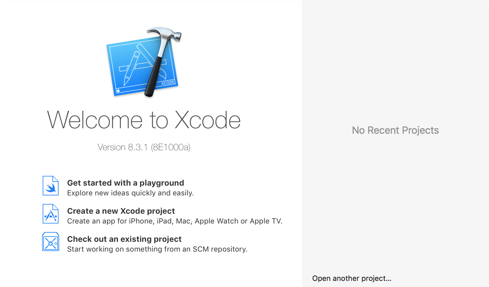
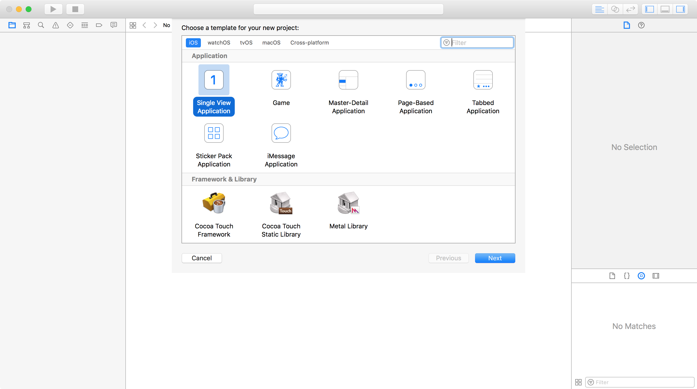
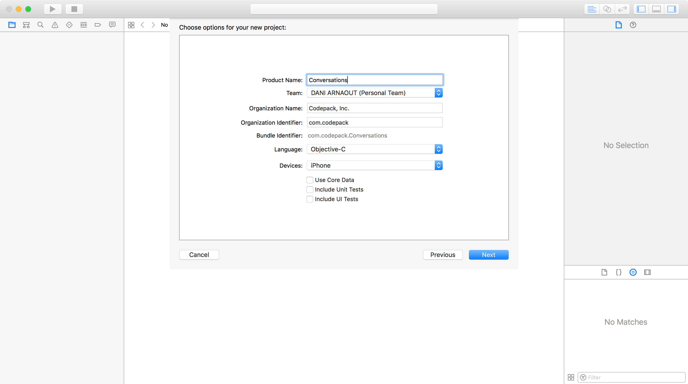
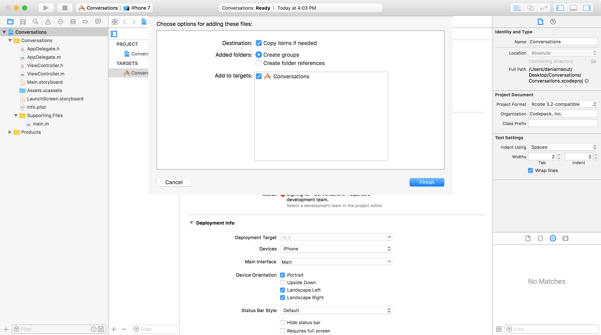
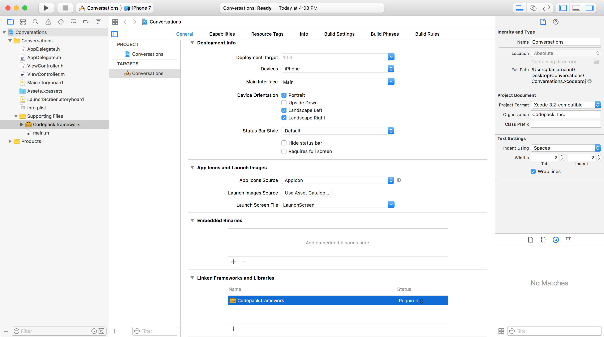
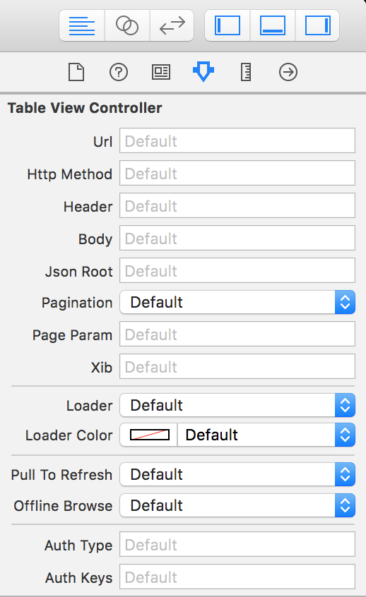

# Getting started

> Follow this guide to integrate the framework into your project

### Install framework
1. Open Xcode and select "Create a new Xcode project"
 

 
2. Create a "Single View Application" and hit Next
 

3. Name your project "Conversations" and save it any place you want
 

4. Download Codepack. (Installation via Coacoapods will be available soon)
5. Drag Codepack.framework into your project and make sure "Copy items if needed" is checked
 

6. Go to general tab under your project's target and scroll to the bottom
 

7. Delete Codepack.framework from "Linked Frameworks and Libraries"

8. Tap (plus) sign in "Embedded Binaries" section, and add Codepack there

### Get license key
Head to the dashboard to get your special license key.

### Show me the magic
As soon as you integrate the framework within your project, `UIKit` classes like `UITableViewController` will acquire extra powers, that is more attributes in the Attributes Inspector.

### Where to go next?
Check out the [Table View](../table-view/) or the [Collection View](../collection-view/) example.