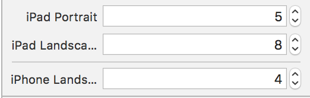
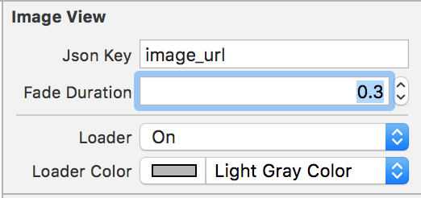
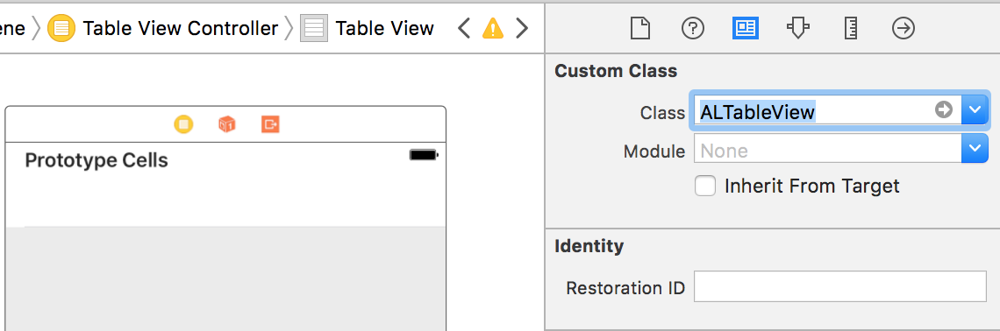
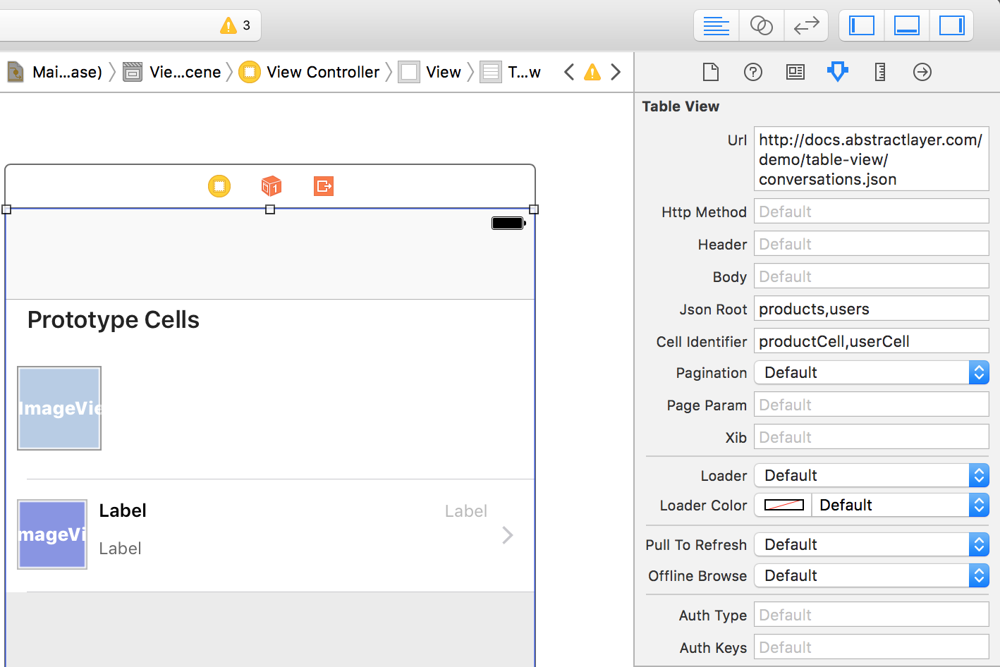
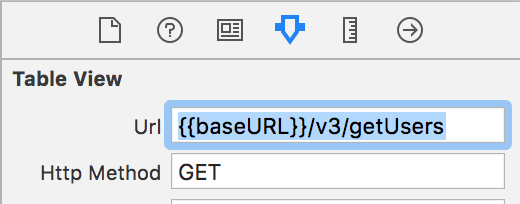
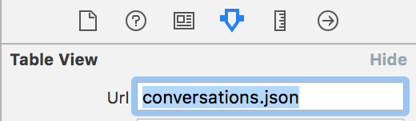

# FAQ

> This section has answers to all your technical questions about Abstract Layer

### Can I modify the table/collection view cell UI by code?

**Yes.**

UITableViewCell & UICollectionViewCell are left untouched. You can simply subclass them and link your UI elements, just like what you used to do.
Inside `awakeFromNib` in your subclass, do any UI changes programatically.

```Swift
  override func awakeFromNib() {
    super.awakeFromNib()
  }
```

```Objective-C
- (void)awakeFromNib {
    [super awakeFromNib];
    // Initialization code
}
```

---

### Can I modify a label’s text before displaying it (Ex: If JSON returns `price` in USD and I want to display it in EUR)

**Yes.**

You have full access to both the UI elements in the cell, and to the JSON array.
The recommended way is doing it in `cellForRowAtIndex`.
The only difference is, you should call:

```Swift
let cell = tableView.cellForRow(at:indexPath)
```

```Objective-C
UITableViewCell *cell = [tableView cellForRowAtIndexPath:indexPath];
```
instead of calling:

``` Swift
let cell = tableView.dequeueReusableCell(withIdentifier: "cell", for: indexPath)
```

```Objective-C
UITableViewCell *cell = [tableView dequeueReusableCellWithIdentifier:@"cell" forIndexPath:indexPath];
```

Which will return the final cell that has all the data inside.
Now, you can change any value you need.

```Swift
  func tableView(_ tableView: UITableView, cellForRowAt indexPath: IndexPath) -> UITableViewCell {
    let cell = tableView.cellForRow(at: indexPath) as! CustomTableViewCell
    var price = Float(cell.priceLabel?.text ?? "") // Price in USD
    price = price! * 0.85 // Convert to EUR
    cell.priceLabel?.text = String(describing: price) // Set new value
    
    return cell
  }
```

```Objective-C
- (UITableViewCell *)tableView:(UITableView *)tableView cellForRowAtIndexPath:(NSIndexPath ###)indexPath {
  CustomTableViewCell *cell = [tableView cellForRowAtIndexPath:indexPath];
  
  // Convert from USD to EUR
  CGFloat price = cell.priceLabel.text.floatValue; // Price in USD
  price = price * 0.85; // Convert to EUR
  cell.priceLabel.text = [NSString stringWithFormat:@"%.2f",price]; // Set new value
  
  return cell;
}
```

---

### Can I implement the native delegate & datasource methods?

**Yes.**

You can simply set the delegate or datasource of `ALTableView` or `ALCollectionView` to any of your own classes.

**NOTE:**

**Delegate:** If you set your own class to be the delegate, make sure you also copy/paste this method:

Table View:

```Swift
  func tableView(_ tableView: UITableView, heightForRowAt indexPath: IndexPath) -> CGFloat {
    let table = tableView as! ALTableView
    return table.heightForRow(at: indexPath)
  }
```

```Objective-C
- (CGFloat)tableView:(UITableView *)tableView heightForRowAtIndexPath:(NSIndexPath *)indexPath {
  return [(ALTableView *)tableView heightForRowAtIndexPath:indexPath];
}
```

**DataSource:** If you set your own class to be the dataSource, make sure you also copy/paste these method:

Table View:

```Swift
  func tableView(_ tableView: UITableView, numberOfRowsInSection section: Int) -> Int {
    return tableView.numberOfRows(inSection: section)
  }
  
func collectionView(_ collectionView: UICollectionView, cellForItemAt indexPath: IndexPath) -> UICollectionViewCell {
    let cell = collectionView.cellForItem(at: indexPath)
    return cell!
  }
```

```Objective-C
- (NSInteger)tableView:(UITableView *)tableView numberOfRowsInSection:(NSInteger)section {
  return [tableView numberOfRowsInSection:section];
}

- (UITableViewCell *)tableView:(UITableView *)tableView cellForRowAtIndexPath:(NSIndexPath *)indexPath {
  UITableViewCell *cell = [tableView cellForRowAtIndexPath:indexPath];
  // Optional: Add your custom code here
  return cell;
}
```

Collection View:

```Swift
  func collectionView(_ collectionView: UICollectionView, numberOfItemsInSection section: Int) -> Int {
    let items = collectionView.numberOfItems(inSection: section)
    return items
  }
  
  func collectionView(_ collectionView: UICollectionView, cellForItemAt indexPath: IndexPath) -> UICollectionViewCell {
    let cell = collectionView.cellForItem(at: indexPath)
    return cell!
  }
```

```Objective-C
- (NSInteger)collectionView:(UICollectionView *)collectionView numberOfItemsInSection:(NSInteger)section {
  return [collectionView numberOfItemsInSection:section];
}

- (UICollectionViewCell *)collectionView:(UICollectionView *)collectionView cellForItemAtIndexPath:(nonnull NSIndexPath *)indexPath {
  UICollectionViewCell *cell = [collectionView cellForItemAtIndexPath:indexPath];
  // Optional: Add your custom code here
  return cell;
}
```

---

### How do I know if the table/collection has loaded?

`ALTableView` & `ALCollectionView` has a new delegate designed for status update. These are `<ALTableViewLoadingDelegate>` and `<ALCollectionViewLoadingDelegate>`

Each delegate provides two optional protocols for will/did load.

Table View:

```Swift
func willLoadTableView()

func didLoadTableViewWithError(_ error: Error!)
```

```Objective-C
- (void)willLoadTableView;

- (void)didLoadTableViewWithError:(NSError *)error;
```

Collection View:

```Swift
func willLoadCollectionView()
  
func didLoadCollectionViewWithError(_ error: Error!)
```

```Objective-C
- (void)willLoadCollectionView;
```

func didLoadTableViewWithError(_ error: Error!)
Set `loadingDelegate` to one of your classes, then implement any of those methods accordingly.

Example:

```Swift
tableView.loadingDelegate = self
``` 

```Objective-C
self.tableView.loadingDelegate = self;
``` 
And

```Swift
collectionView.loadingDelegate = self
``` 

```Objective-C
self.collectionView.loadingDelegate = self;
``` 

---

### Can I have different number of columns in a collection view according to different device types and orientation?

**Yes.**

From your attribute inspector, just choose the number of columns for each device.

The available options are:

* iPhone portrait
* iPhone landscape
* iPad portrait
* iPad landscape



---

### How do I know if any error occurs while loading the table/collection?

`ALTableView` & `ALCollectionView` has a new delegate designed for status update. These are `<ALTableViewLoadingDelegate>` and `<ALCollectionViewLoadingDelegate>`

Each delegate provides an optional protocols to know when your view loads.

Table View:

```Swift
func didLoadTableViewWithError(_ error: Error!)
```

```Objective-C
- (void)didLoadTableViewWithError:(NSError *)error;
```

Collection View:

```Swift
func didLoadCollectionViewWithError(_ error: Error!)
```

```Objective-C
- (void)didLoadCollectionViewWithError:(NSError *)error;
```

Set `loadingDelegate` to one of your classes, then implement this method.
If the `error` object is empty, then no error occured.
Otherwise, you can print out the `error.localizedString` to check for the error details.

---

### Do I have access to the JSON response data if I need to extract any values?

**Yes.**

Within your `ALTableView` or `ALCollectionView` instance, there's a property called `array`. This represents the parsed array of models that populates your view.

```Swift
collectionView.array
tableView.array
```

```Objective-C
self.collectionView.array
self.tableView.array
```

---


### Can I pass dynamic parameters to the table/collection view?

**Yes.**

Check out the `Parameters` section in the guide.

[Parameters for table view.](../../menu/table-view/parameters)

[Parameters for collection view.](../../menu/collection-view/parameters)

---

### Can I have a collection view inside a table view inside a table view?

**Yes.**

Not sure why would you need that, but yes, you can do that.

Each instance of `ALTableView` or `ALCollectionView` is a separate entity, so you can simply have as much of those in 1 view controller.

Just implement each one by setting its attribute from the attribute inspector, and you're ready!

---


### How do I push data from the selected table view cell to the next view controller?

Within your `ALTableView` or `ALCollectionView` instance, there's a property called `array`. This represents the parsed array of models that populates your view.

For example, here's how you push the data of the cell the user has just tapped:

```Swift
  func tableView(_ tableView: UITableView, didSelectRowAt indexPath: IndexPath) {
    let table = tableView as! ALTableView
    let item = table.array[indexPath.row]
    // You're good to go.
  }
```

```Objective-C
- (void)tableView:(UITableView *)tableView didSelectRowAtIndexPath:(NSIndexPath *)indexPath {
  NSDictionary *item = self.tableView.array[indexPath.row];
  // You're good to go.
}
```

---

### Can I use XIBs instead of storyboard?

**Yes.**

Refer to the guide about XIB.

[XIB for table view.](../../menu/table-view/xib)

[XIB for collection view.](../../menu/collection-view/xib)

---

### How do I add a loader to image?

Simply, click on your `ALImageView` and head to your attribute inspector.

Turn on the loader to `ON` and pick a color for your loader.


---

### Can I use Abstract Layer table view inside a UITableViewController?

**Yes.**

Simply, click on the table view inside the `UITableViewController` that you drag to your storyboard and set its class to `ALTableView`, and there you go.



---

### Can I add an ‘edit’ or ‘delete’ option in a table/collection view?

**Yes.**

Copy/paste the following methods, and you'll be set. Abstract Layer handle deleting the cells and their corresponding data from the datasource.

```Swift
  func tableView(_ tableView: UITableView, canEditRowAt indexPath: IndexPath) -> Bool {
    return true
  }
```

```Swift
  func tableView(_ tableView: UITableView, commit editingStyle: UITableViewCellEditingStyle, forRowAt indexPath: IndexPath) {
    if editingStyle == .delete {
      let table = tableView as! ALTableView
      table.commit(.delete, forRowAt: indexPath)
    }
  }
```
  
```Objective-C
- (BOOL)tableView:(UITableView *)tableView canEditRowAtIndexPath:(NSIndexPath *)indexPath {
    return YES;
}
```

```Objective-C
- (void)tableView:(UITableView *)tableView commitEditingStyle:(UITableViewCellEditingStyle)editingStyle forRowAtIndexPath:(NSIndexPath *)indexPath {
  [(ALTableView *)tableView commitEditingStyle:editingStyle forRowAtIndexPath:indexPath];
}
```
---

### Can I add headers and footers to the table?

**Yes.**

Abstract Layer doesn't modify anything related to headers or footers, so just do it the regular way by dragging a view on top of your `UITableView` in storybaord, or do it by code.

---


### Can I display multiple sections each with a different cell prototype out of the same JSON?

**Yes.**

Imagine you have a JSON document with two keys: `users` and `products`, each holds an array of values that needs to be displayed in a different cell.

```JSON
{"products":[
  {
	"image_url": "https://firebasestorage.googleapis.com/v0/b/abstract-layer.appspot.com/o/Demo%2FCollectionView%2FSaily%2F1.jpg?alt=media&token=55ec1562-7454-4948-8f17-b6aa7479ce42",
	"name": "Black Dress",
	"price": "35",
	"id": "5925b5ac22f9a51d0ca5a3ce"
  },
	{"image_url": "https://firebasestorage.googleapis.com/v0/b/abstract-layer.appspot.com/o/Demo%2FCollectionView%2FSaily%2F2.jpg?alt=media&token=dd02becb-cd1c-417e-bd69-29be24f20bfa",
	"timestamp": 1491639798,
	"name": "iMac 2017",
	"price": "750",
	"id": "5925b5ac58cff049f195e566"
  }],
"users":[
  {
    "image_url": "https://randomuser.me/api/portraits/women/94.jpg",
    "timestamp": 1491631526,
    "last_message": "Lorem ut irure est reprehenderit non non nulla duis mollit.",
    "name": "Kirby Gallagher",
    "id": "5925b5ac22f9a51d0ca5a3ce"
  }]
}
```

You add 2 JSON Roots and 2 Cell Identifiers in the way you want them to be displayed. 

Abstract layer will automatically display each in a section, and load the content.



---

### Can I re-arrange table/collection view cells?

**Yes.**

Add the following method to your datasource class:

```Swift
  func collectionView(_ collectionView: UICollectionView, canMoveItemAt indexPath: IndexPath) -> Bool {
    return true
  }
```

```Objective-C
- (BOOL)tableView:(UITableView *)tableView canMoveRowAtIndexPath:(NSIndexPath *)indexPath {
    return YES;
}
```

And 

```Swift  
  func collectionView(_ collectionView: UICollectionView, moveItemAt sourceIndexPath: IndexPath, to destinationIndexPath: IndexPath) {
    collectionView.moveItem(at: sourceIndexPath, to: destinationIndexPath)
    // Do your custom work
  }
```

```Objective-C
- (void)tableView:(UITableView *)tableView moveRowAtIndexPath:(NSIndexPath *)fromIndexPath toIndexPath:(NSIndexPath *)toIndexPath {
  return [tableView moveRowAtIndexPath:fromIndexPath toIndexPath:toIndexPath];
}
```

Abstract Layer will take care of updating both, the table/collection and the datasource array to match the updated results.

---

### Can I use a base URL instead of having to retype the server address overtime?

**Yes.**

The benefit of having a base URL is to be able to switch in one place so that it applies to the whole app.
This is useful when switching between development and release environments.

To acheive that, add the following code in the class that handles networking or constants.

```Swift
let baseURL = "http://localhost:8888"
ALStore.sharedInstance().setValue(baseURL, forKey: "baseURL")
```

```Objective-C
[[ALStore sharedInstance] setValue:@"http://localhost:8888" forKey:@"baseURL"];
```

Now, you can use double curley braces in your URL field in the attribute inspector.



This will automatically be translated to: 

`http://localhost:8888/v3/getUsers`

---

### Can I have different cell heights in collection view (Pinterest UI)?

**Yes.**

To acheive a Pineterest-like UI, you only have to provide the height of the collection view cell, and Abstract Layer will automatically handles sizing and viewing of a coherent-looking collection view.

Implement this method in your datasource class:

```Swift
  func collectionView(_ collectionView: UICollectionView!, heightForItemAt indexPath: IndexPath!, itemInfo item: [AnyHashable : Any]!) -> CGFloat
```

```Objective-C
- (CGFloat)collectionView:(UICollectionView *)collectionView heightForItemAtIndexPath:(NSIndexPath *)indexPath itemInfo:(NSDictionary *)item;
```

---

### Do you cache images? And how does it work?

**Yes.**

Image downloading and caching are handled automatically.

As soon as you set the `JSON key` of your `ALImageView`, Abstract Layer will automatically download and cache the image both in memory and on disk, and serve it as needed.

The cache itself is managed internally to clean itself in case of a memory warning or if the downloaded images aren't used for a long time.

---

### Does Abstract Layer use any 3rd party dependencies?

**No.**

Abstract Layer avoids relying on any 3rd party dependencies. Instead, all needed components that the native iOS SDK doesn't provide, are built and maintained by our engineers.

---

### What is the size of the framework

The average size of the framework is around `3 MB` only!

---

### Can I subclass the ALTableView/ALCollectionView to do my own customization? 

**Yes.**

Remember, `ALTableView` and `ALCollectionView` are simply subclasses of `UITableView` and `UICollectionView` respectively.

Feel free to subclass them and do your own implementation.

Moreover, set their `delegates` & `datasources` to any object of your own classes.

---

### How do I know if there’s a parsing error in a table?

`ALTableView` & `ALCollectionView` has a new delegate designed for status update. These are `<ALTableViewLoadingDelegate>` and `<ALCollectionViewLoadingDelegate>`

Each delegate provides an optional protocols to know when your view loads.

Table View:

```Swift
func didLoadTableViewWithError(_ error: Error!)
```

```Objective-C
- (void)didLoadTableViewWithError:(NSError *)error;
```

Collection View:

```Swift
func didLoadCollectionViewWithError(_ error: Error!)
```

```Objective-C
- (void)didLoadCollectionViewWithError:(NSError *)error;
```

Set `loadingDelegate` to one of your classes, then implement this method.
If the `error` object is empty, then no error occured.
Otherwise, you can print out the `error.localizedString` to check for the error details.

---


### How do I know if there’s a URL or server error in a table/collection?

`ALTableView` & `ALCollectionView` has a new delegate designed for status update. These are `<ALTableViewLoadingDelegate>` and `<ALCollectionViewLoadingDelegate>`

Each delegate provides an optional protocols to know when your view loads.

Table View:

```Swift
func didLoadTableViewWithError(_ error: Error!)
```

```Objective-C
- (void)didLoadTableViewWithError:(NSError *)error;
```

Collection View:

```Swift
func didLoadCollectionViewWithError(_ error: Error!)
```

```Objective-C
- (void)didLoadCollectionViewWithError:(NSError *)error;
```

Set `loadingDelegate` to one of your classes, then implement this method.
If the `error` object is empty, then no error occured.
Otherwise, you can print out the `error.localizedString` to check for the error details.

---

### Can I implement force touch on a cell?

**Yes.**

Just like any other native iOS `API`, touch force can be implemented just as if you would implement it without Abstract Layer.

Remember, `ALTableView` and `ALCollectionView` are simply subclasses of `UITableView` and `UICollectionView` respectively.

---


### Does the table view support different encodings for different http methods?

**Yes.**

For `GET` http methods, URL encoding is applied.

For `POST`, `UPDATE`, and `DELETE` http methods, the parameters are encoded and sent in a JSON format.

---

### What do you use to handle network requests? Is it native NSURLSession or any other 3rd party library?

Abstract Layer builds on top of native iOS SDK frameworks to handle major aspects of app development. It's engineered to avoid relying on any 3rd party dependencies.

So `NSURLSession` is used as the core networking component in building and managing requests & sessions.

---

### What if your JSON document is a local file?

If you JSON document is a local file (in your app bundle), add its name in the URL section, and that's it. 

Abstrac Layer will look into your app's bundle and process the JSON document just like it was downloaded from an API.



---