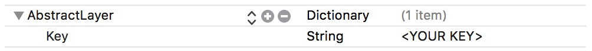

# Getting started

> Follow this guide to integrate the framework into your project

### Create a new project

> If you have an existing project, skip to [Install framework](../../menu/getting-started/README?id=install-framework).

1. Open Xcode and select `Create a new Xcode project`
<br/>

 
2. Create a `Single View Application` and hit Next
<br/>


3. Name your project `Conversations` and save it any place you want
<br/>


### Install framework

4. <a href="https://github.com/DaniArnaout/DaniArnaout.github.io/raw/master/framework/AbstractLayer%20v1.0.zip">Download Abstract Layer framework.</a> (Installation via Coacoapods will be available soon)
5. Unzip it, and drag `AbstractLayer.framework` into your project and make sure `Copy items if needed` is checked
<br/>


6. Go to `General` tab under your project's target and scroll to the bottom
<br/>


7. Delete `AbstractLayer.framework` from `Linked Frameworks and Libraries`

8. Tap (plus) sign in `Embedded Binaries` section, and add `AbstractLayer.framework` there

### Get license key

After purchasing a license, you will recieve a personal key to use in your projects.

To get your free tiral license key, email us at <a href="mailto:support@abstractlayer.com?Subject=Free%20Trial%20Key%20Request" target="_top">support@asbtractlayer.com</a>
</p>

### Set license key

* Go to `info.plist` and add a new entry with key `AbstractLayer`
* Set its type to `Dictionary`
* Add a new key/value pair
* Set the key to `Key`
* Set the value to your license key



Raw format:
```xml
	<key>AbstractLayer</key>
	<dict>
		<key>Key</key>
		<string>0B3Hwd79FbAvwesY6/xHNQnHVOinJdse23jKaE4=</string>
	</dict>
```

> The provided key in this example is just a sample. You should insert your won key instead


### Show me the magic
As soon as you integrate the framework within your project, `UIKit` classes like `UITableView` and `UICollectionView` will acquire extra powers, that is more attributes in the Attributes Inspector.


### Where to go next?
Now that you're all set, you can check out either the [Table View](/menu/table-view/) or the [Collection View](/menu/collection-view/) example.