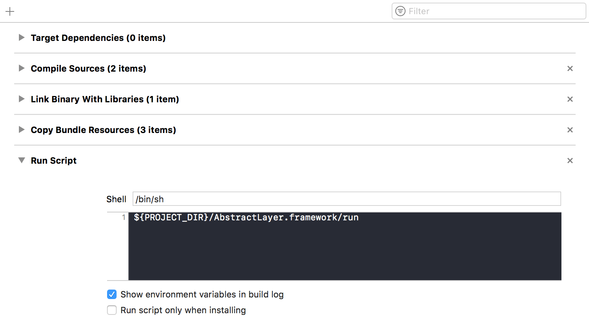

# Activate your license

* <a href="https://github.com/DaniArnaout/DaniArnaout.github.io/raw/master/software/AbstractPro_1.0.dmg">Download AbstractPro Manager</a>

* Log in using the **email** and **activation key** you received via email

* Go to you Xcode project, and navigate to `Build Phases`

* Tap on `+` then `Add Run Script` and add the following line:

**`${PROJECT_DIR}/AbstractLayer.framework/run`**

* Build the project, and you're good to go

### Where to go next?
You're all set, check these examples:
* [Table View](/menu/table-view/) 
* [Collection View](/menu/collection-view/)