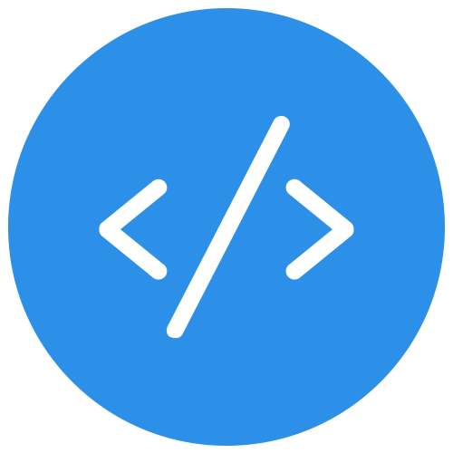

# Premium Features
> Abstract Layer premium features will cut down your development work significantly. No need to check Github for 3rd-party libraries that handle small repetitive tasks, and there's no need to constantly check Apple's documentation for code samples. This will also bring down your StackOverflow usage to a minimum.

  

### Forms & Validation

UITextField has gone to the next level, it can finally do some validations out of the box.
All common field validations are available out of the box like email, password, phone number, date, name, and much more. You can set your regex validation rules too.

### Button Actions

Sending requests with buttons is now done purely in interface builder. Just set some parameters like the URL request and you're good to go.

### Navigation & Menus

Side menus and scrollable top menus are now available to integrate in few minutes. No need to struggle to look for a library hoping it's customizable enough to fit your needs. With Abstract Layer navigation, you can have any customizable menu you want.

### Animation Kit

You can now create animations in iOS like you do on Keynote and Powerpoint. Abstract Layer provides a set of ready animations that can be integrated easily by simply specifying the type of animation and configuring the options right from interface builder.

### Code Snippets

No more visits to StackOverflow or Apple's documentation to copy random code snippets. You can now simply drag and drop those within Xcode. Examples are code snippets for camera, gallery, address book, Bluetooth APIs, alert controller, network requests, block parameters and much more.

