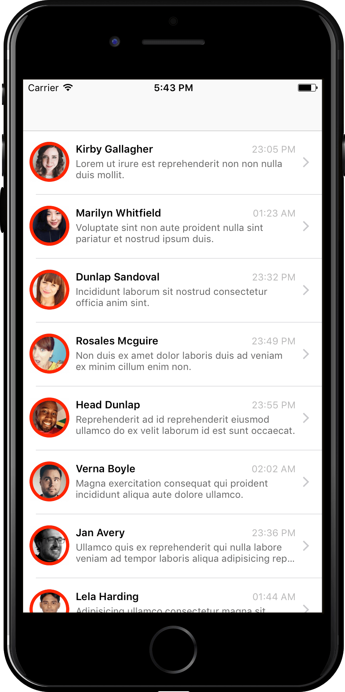
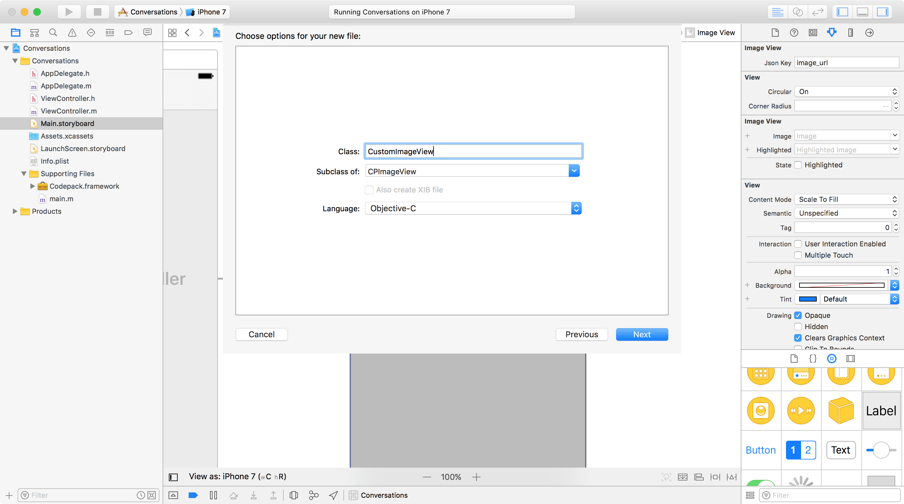
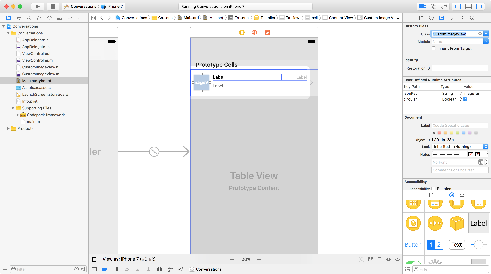

# Custom cases

> Learn how fully customizable Table View is

This tutorial covers the following customizations:

1. UI customization
2. Conditionals
3. Edit/Delete
4. Pass data between view controllers
5. Status

By now, this looks magical, but what if you want to customize any of the elements or data?

It's very simple. Codepack subclasses from UIKit classes directly without messing around with the initial implementation. You can simply subclass any of Codepack's classes and do your own customization.

## UI customization

**Example**: Add a thick red border to CPImageView.



For that you can do either:

* Subclass UITableViewCell and do you UI customizations
* Subclass CPImageView and do your UI customizations

We'll go with the second option, since it involves modifying a Codepack component.

1. Choose "File" → "New" → "File" from Xcode's menu bar
2. Choose a "Cocoa Touch Class", call it CustomImageView and subclass it from CPImageView

3. In your storyboard, click on the image view and change its subclass to "CustomImageView"


4. Head to your CustomImageView.h and import Codepack instead of UIKit 
`#import <Codepack/CPImageView.h>`

5. Head to your CustomImageView.m and override layoutSubviews with the code that adds a red border

```objective-c
- (void)layoutSubviews {
  [super layoutSubviews];
   
  self.layer.borderColor = [UIColor redColor].CGColor;
  self.layer.borderWidth = 4.0f;
}
```
That's it. Just run your project, and see for yourself!

## Conditionals
Assume you want to have a table with alternate row colors (First row with white background, second with blue, third with white, and so on).
This is exactly the same way you would do it without Codepack. Simply override

```objective-c
- (UITableViewCell *)tableView:(UITableView *)tableView cellForRowAtIndexPath:(NSIndexPath *)indexPath {
 
  UITableViewCell *cell = [super tableView:tableView cellForRowAtIndexPath:indexPath];
 
  if (indexPath.row %2) {
    cell.contentView.backgroundColor = [UIColor whiteColor];
  } else {
    cell.contentView.backgroundColor = [UIColor blueColor];
  }
  return cell;
}
```

> **Notice**: Instead of calling `dequeueReusableCellWithIdentifier:` to get an empty cell, call super to get the cell with all data inside.
Now, feel free to modify anything within the cell, and make sure you return it. It's as simple as that.

## Edit/Delete
Just like what you saw in the previous example, you can override any delegate or datasource method to achieve custom results.
For example, if you want to integrate re-ordering or deleting cells, all of that is done automatically as soon as you allow it.

```objective-c
- (BOOL)tableView:(UITableView *)tableView canEditRowAtIndexPath:(NSIndexPath *)indexPath {
  return YES;
}
```

UI actions are there, you just need to implement any extra actions like sending a new request to delete that specific object or re-order it.

```objective-c
- (void)tableView:(UITableView *)tableView commitEditingStyle:(UITableViewCellEditingStyle)editingStyle forRowAtIndexPath:(NSIndexPath *)indexPath {
  if (editingStyle == UITableViewCellEditingStyleDelete) {
    [super tableView:tableView commitEditingStyle:editingStyle forRowAtIndexPath:indexPath];
  }
}
```

To allow re-ordering, use this code:

```objective-c
- (void)tableView:(UITableView *)tableView moveRowAtIndexPath:(NSIndexPath *)sourceIndexPath toIndexPath:(NSIndexPath *)destinationIndexPath {
  [super tableView:tableView moveRowAtIndexPath:sourceIndexPath toIndexPath:destinationIndexPath];
}
```

After that, implement any extra customization code.

## Pass data between view controllers
`CPTableViewController` has an array property, which is an array of NSDictionary of the JSON object. Just pass the portion of data you need and use it in other View Controllers.

## Status
To add your custom work for when the table is going to load or after loading items, simply override the following methods in `CPTableViewController`'s subclass accordingly:

```objective-c
- (void)willLoadTableView;
- (void)didLoadTableViewWithError:(NSError *)error;
```

## Where to go next?
Check out how awesome [collection view](../collection-view) is