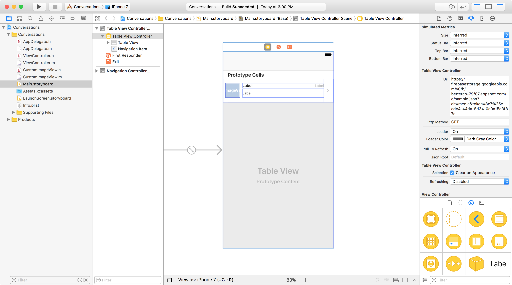
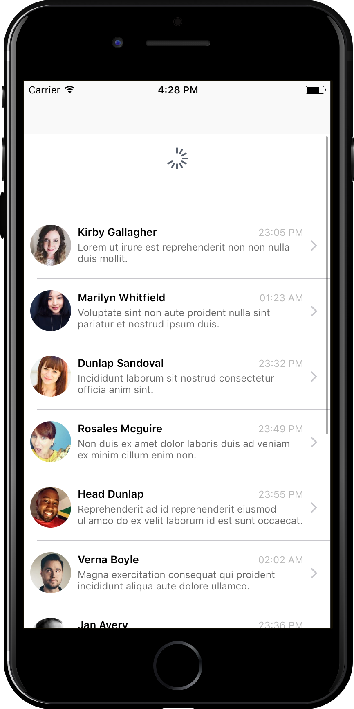

# Loader & Pull to refresh

> Add a loader & pull to refresh functionality by switching on two options

`CPTableViewController` offers more options out of the box.
Click on your table view and look at the attributes inspector options:

1. To add a loader, just turn on the "Loader" option to "ON" and pick a color
2. What about pull to refresh feature? Simply switch it "ON" as well

Run the project and see the loader before the data is populated. After that, scroll up, and see your native UIRefreshControl fully functional without having to worry about any implementation.

Impressive, right?!

## Where to go next?
Check out the other TableView tutorials like [XIB](../table-view/xib) & [Authentication](../table-view/authentication).