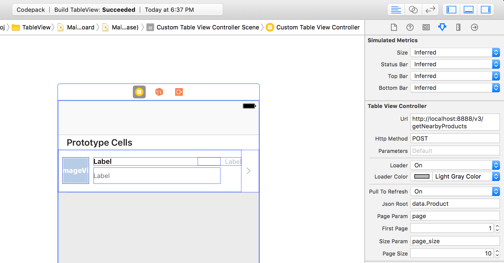

# Pagination

> Learn how to support pagination in 2 simple steps

In most cases, an API populated Table View includes pagination.

This means that you'll have to do the following:

* Monitor user scrolling so you load more records when the user reaches the bottom of the table
* Keep track of the current page to send it as a parameters to load the next page
* Retrieve data, parse it, and add it to your array

Abstract Layer handles pagination automatically & magically. You only need to provide two things:

1. **Page parameter**: What is the page parameter called? (Check your backend API)
2. **Initial page number**: What's the first page number? By default it's either 0 or 1 depending on the backend API.

In the example below the page parameter is called "page", and the initial page number is passed as a regular parameter `page=0`.
Don't forget to turn ON `Pagination`.

> Note: This tutorial doesn't have an up and running online server & API that you can hit. Please try it on any of your existing projects.

## Where to go next?
Check out the other TableView tutorials like [parsing](../table-view/parsing) & [Loader](../table-view/loader).